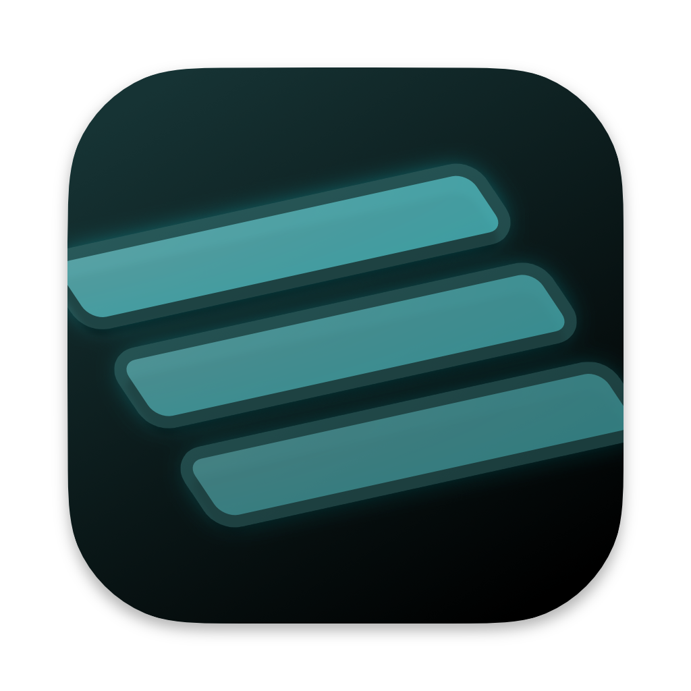
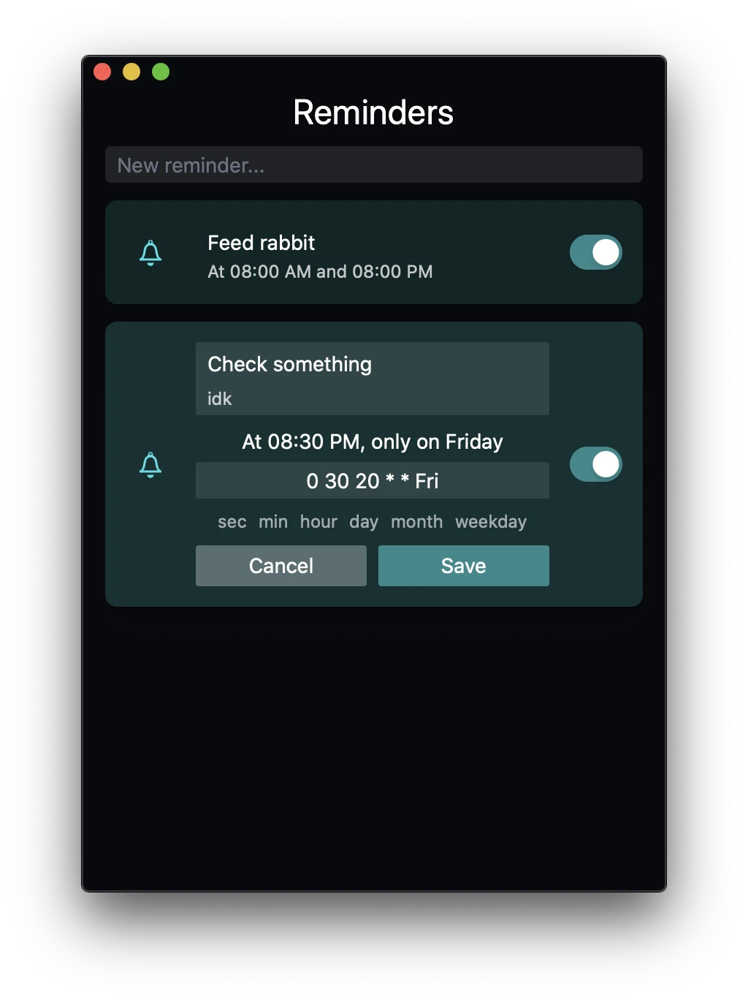

# Remind Me Again

  

<h3 align="center">Remind Me Again</h3>

  Toggleable reminders app for Mac, Linux and Windows
   
  <a href="https://github.com/probablykasper/remind-me-again/releases"><b>Download for Mac, Windows or Linux</b></a>

  

## Dev instructions

### Get started

1. Install Node.js
2. Install Rust
3. Follow the [Tauri setup guide](https://tauri.studio/en/docs/get-started/intro)
4. Run `npm install`

### Commands
- `npm run dev`: Start app in dev mode
- `npm run build`: Build
- `npm run lint`: Lint
- `npm run format`: Format

### Release new version
1. Update `CHANGELOG.md`
2. Bump the version number in `src-tauri/Cargo.toml`
3. Run `npm run check` to update `Cargo.lock`
4. Create a git tag in the format `v#.#.#`
5. Add release notes to the generated GitHub release and publish it
